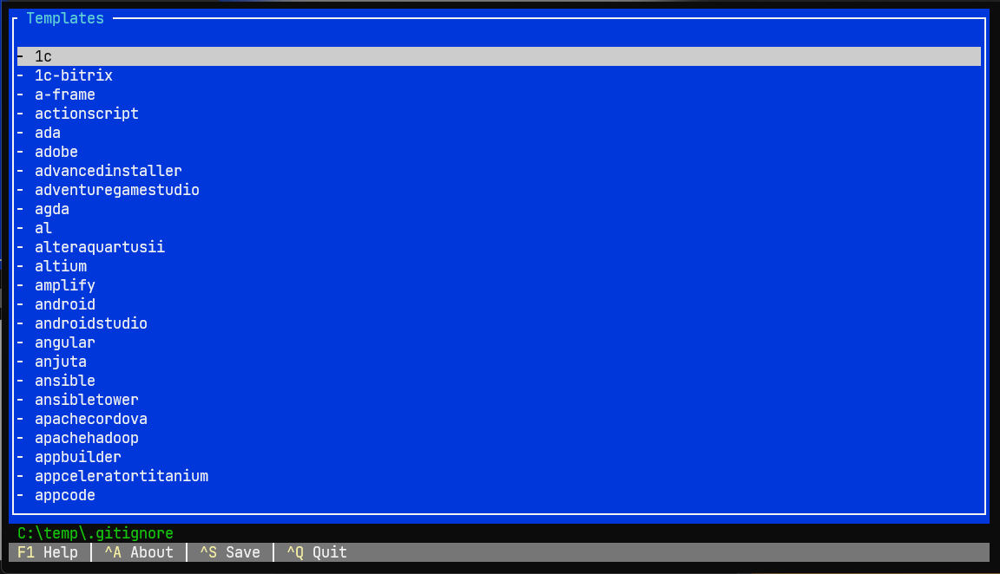

# mkgig - A cross-platform terminal UI for generating .gitignore files.

### Usage
Use this console app to create a .gitignore file for one or more
operating systems, programming languages or IDEs, using
templates from [gitignore.io](https://gitignore.io).

* Select the templates to include in the file.
  - Use the up and down arrows to highlight a template.
  - Press the spacebar to select the highlighted template.
  - Hint: Type all or part of a template's name to filter the list.
* Press Ctrl+S to write the .gitignore file to disk.
  - The path and file name are shown below the list.
  - If the .gitignore file aleady exists, you will be given
    the option to overwrite it or append to it.
* Press Ctrl+Q to close the app without writing the .gitignore
  file.

### Build

This app is written in .NET 7, and can be used on any supported operating system/architecture.

`$ dotnet build --os [osx | win | linux]  --configuration Release`

This app uses the [Terminal.Gui toolkit for .NET](https://github.com/gui-cs/Terminal.Gui)